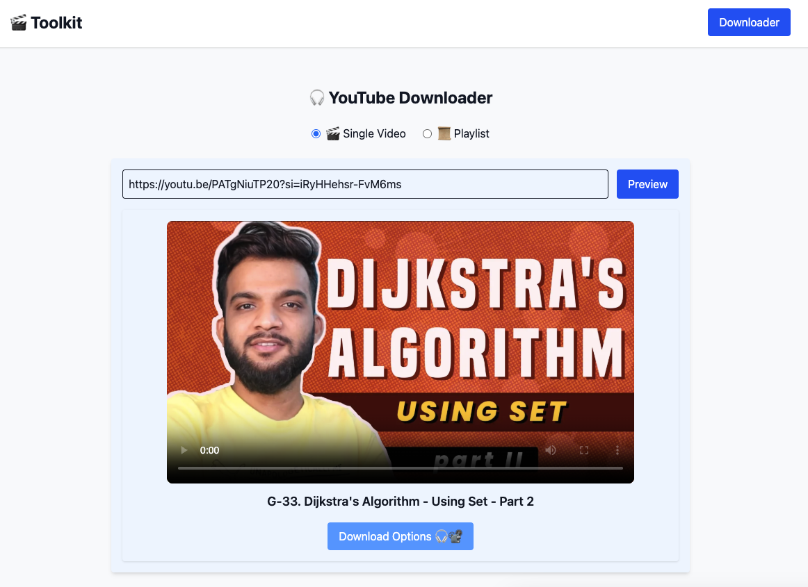
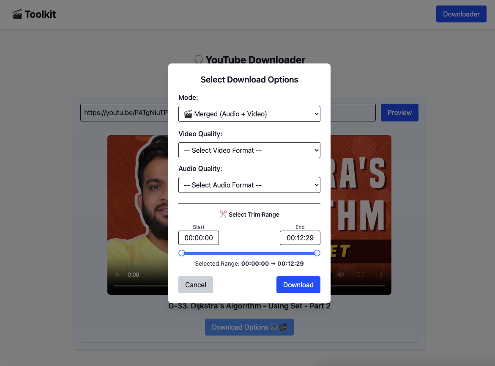
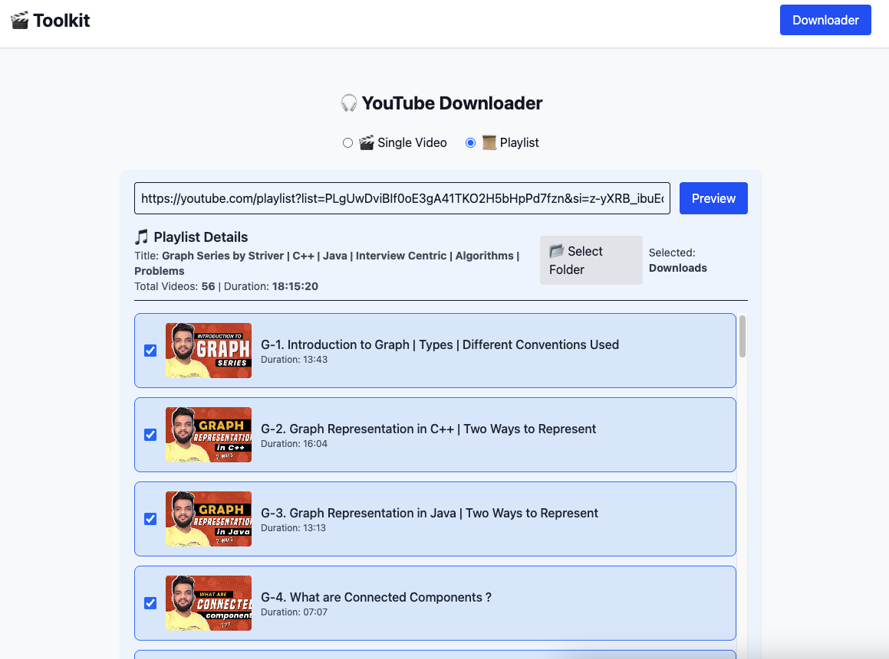
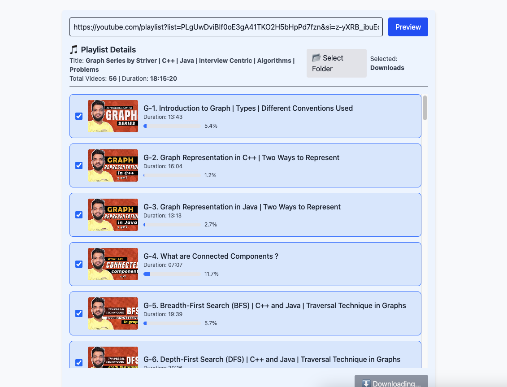

# 🎬 Audio & Video Downloader Utility

A powerful utility for downloading **audio and video** from YouTube and playlists using **FastAPI**, **React (Vite)**, and **Docker**.  
Supports both **server-side download** and **direct client download**.


---

## ⚠️ Legal Disclaimer

This project is intended **solely for educational and personal use**.

Downloading videos, audio, or any other content from YouTube **without explicit permission** may violate YouTube’s [Terms of Service](https://www.youtube.com/t/terms) and applicable copyright laws.

By using this tool, you agree to:

- ✅ Use it **only for content you own** or have been granted permission to download.  
- 🚫 Not use it for any commercial purpose or public distribution.  
- ⚖️ Assume full responsibility for how you use this software.

The developer of this project ([@AnshumanPrajapati](https://github.com/anshumanprajapatiap)) **does not endorse or encourage** the unauthorized downloading or redistribution of copyrighted material.

If you’re experimenting, please use the tool responsibly — it’s meant to demonstrate backend–frontend integration, streaming, and SSE event handling with FastAPI and React.

---
## 📸 Preview

<p align="center">
  
</p>

<p align="center">
  
</p>

<p align="center">
  
</p>


<p align="center">
  
</p>


---

## 🚀 Quick Start (Docker Setup)

### 🧱 1️⃣ Run with Docker Compose
```bash
docker compose up --build
````

This will:

* Start the **FastAPI backend** at [http://localhost:8000](http://localhost:8000)
* Start the **React frontend** at [http://localhost:5173](http://localhost:5173)

````

---

## 🖥️ Run Locally (Without Docker)

### ⚙️ 1️⃣ Create and Activate Virtual Environment

<details>
<summary>macOS / Linux</summary>

```bash
python3 -m venv venv
source venv/bin/activate
````

</details>

<details>
<summary>Windows (PowerShell)</summary>

```bash
python -m venv venv
.\venv\Scripts\activate
```

</details>

✅ Once active, your terminal will show `(venv)` prefix.

---

### ⚙️ 2️⃣ Install Dependencies

```bash
pip install -r requirements.txt
```

---

### ⚙️ 3️⃣ Install ffmpeg (System Dependency)

<details>
<summary>macOS (Homebrew)</summary>

```bash
brew install ffmpeg
```

</details>

<details>
<summary>Ubuntu/Debian</summary>

```bash
sudo apt update && sudo apt install -y ffmpeg
```

</details>

<details>
<summary>Windows</summary>

1. Download from [ffmpeg.org/download.html](https://ffmpeg.org/download.html)
2. Extract and add its `bin` folder to your **System PATH** (e.g., `C:\ffmpeg\bin`)

✅ Verify installation:

```bash
ffmpeg -version
```

</details>

---

### ⚙️ 4️⃣ Run FastAPI in Development Mode

From the project root:

```bash
uvicorn app.main:app --reload --host 0.0.0.0 --port 8000
```

Visit: [http://localhost:8000](http://localhost:8000)

> `--reload` enables hot-reloading on code changes.

---

## 🐳 Docker Manual Commands

### 🧱 1️⃣ Build Image

```bash
docker build -t youtube-downloader .
```

### ▶️ 2️⃣ Run Container (Mount Downloads)

```bash
docker run -d \
  -p 8000:8000 \
  -v $(pwd)/downloads:/app/downloads \
  --name yt-dl youtube-downloader
```

Then open 👉 [http://localhost:8000](http://localhost:8000)

---

### ⚙️ CLI Usage Inside Container

Run downloader directly inside the running container:

```bash
docker exec -it yt-dl python -m app.downloader "https://www.youtube.com/watch?v=YOUR_ID"
```

Or open a shell:

```bash
docker exec -it yt-dl bash
```

---

## 🌍 Access from Anywhere (Global Access)

You can make your **local frontend/backend** accessible on the internet using **ngrok**.

### 🔗 Install ngrok

```bash
brew install ngrok
```

### 🌐 Expose Frontend

```bash
docker compose -f docker-compose-prod.yml up --build -d
ngrok http 5173
```

```bash
docker compose -f docker-compose-prod.yml down
pkill -f ngrok
```


Example output:

```
Forwarding → https://your-subdomain.ngrok-free.app -> http://localhost:5173


docker compose -f docker-compose-local.yml up --build -d
ngrok http 8000 --config ~/.ngrok/backend.yml --log=stdout 
ngrok http 5173 --host-header="localhost:5173" --config ~/.ngrok/frontend.yml --log=stdout

```

### 🌐 Expose Backend

```bash
ngrok http 8000
```

You’ll get a public HTTPS URL that can be accessed globally.

---

## 📁 Project Structure

```
├── app/
│   ├── main.py              # FastAPI entrypoint
│   ├── downloader.py        # Core logic for streaming/download
│   └── utils/               # Helper functions
├── frontend/
│   ├── src/                 # React (Vite) app
│   ├── Dockerfile
│   └── ...
├── docker-compose.yml
├── requirements.txt
└── README.md
```

---

## 🧪 API Endpoints

| Method | Endpoint               | Description                          |
| ------ | ---------------------- | ------------------------------------ |
| `POST` | `/download`            | Start video/audio download or stream |
| `POST` | `/preview/`            | Preview Video Info                   |
| `GET`  | `/download/{filename}` | Download processed file              |

---

## 💡 Features

* 🎧 Download **audio** or **video**
* 📂 Playlist batch processing
* ⚡ Real-time progress via streaming
* 🌐 Accessible locally or globally (via ngrok)
* 🐳 Fully containerized setup (Docker + Docker Compose)

---

## 🧰 Tech Stack

* **Backend:** FastAPI + yt-dlp + FFmpeg
* **Frontend:** React (Vite) + TailwindCSS
* **Deployment:** Docker, Docker Compose
* **Streaming:** FastAPI `StreamingResponse`

---

## 🏁 License

MIT License © 2025 — Made with ❤️ by **Anshuman Prajapati**


```